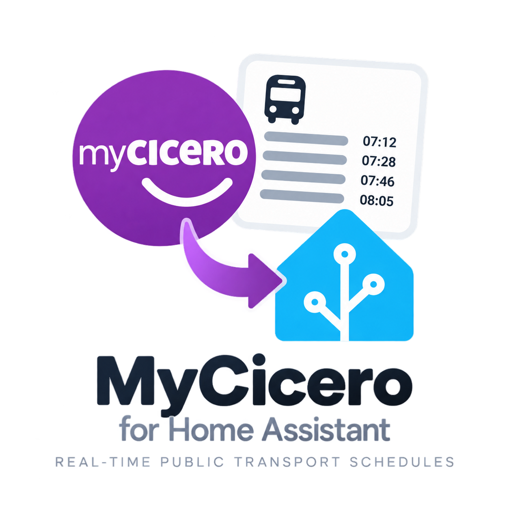

  

# MOM Bus (Mobilità di Marca) per Home Assistant

Integrazione non ufficiale per Home Assistant che mostra i prossimi passaggi degli autobus MOM (Mobilità di Marca, Veneto) a una fermata, usando le API pubbliche (non documentate) del portale [myCicero](https://www.mycicero.it/).

> Integrazione non ufficiale, non affiliata a MOM né a myCicero/PluService. Le API utilizzate non sono documentate pubblicamente e potrebbero cambiare senza preavviso.

## Funzionalità

- Sensore con i minuti al prossimo passaggio a una fermata, filtrabile per linea.
- Attributi con la lista dei prossimi passaggi (linea, destinazione, orario, ritardo, se real-time).
- Configurazione tramite interfaccia utente (config flow), nessun YAML richiesto.

## Installazione

### Tramite HACS

1. In HACS, aggiungi questo repository come [custom repository](https://hacs.xyz/docs/faq/custom_repositories/): `diegobattistuzzi/ha-mom-bus`.
2. Cerca "MOM Bus" tra le integrazioni e installala.
3. Riavvia Home Assistant.

### Manuale

Copia la cartella `custom_components/mom_bus` in `<config>/custom_components/` e riavvia Home Assistant.

## Configurazione

Dopo l'installazione, vai su **Impostazioni → Dispositivi e servizi → Aggiungi integrazione** e cerca "MOM Bus". Inserisci il codice della fermata (visibile nell'URL della fermata su myCicero) e, opzionalmente, il codice della linea da filtrare.

## Disclaimer

Progetto amatoriale basato sull'osservazione del traffico di rete del sito myCicero. Nessuna garanzia di funzionamento continuo.
